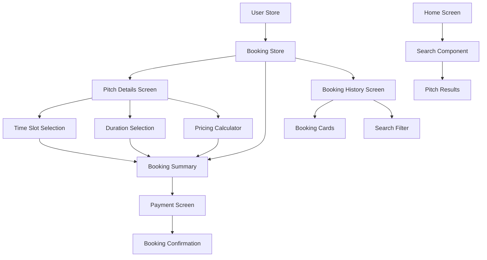
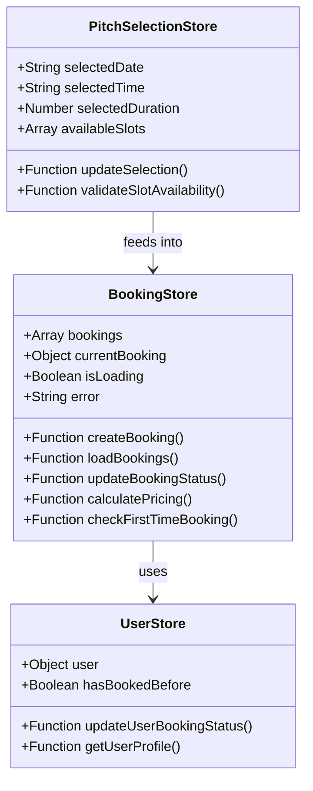
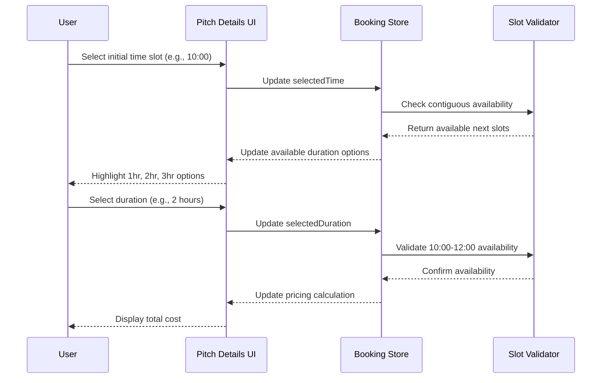
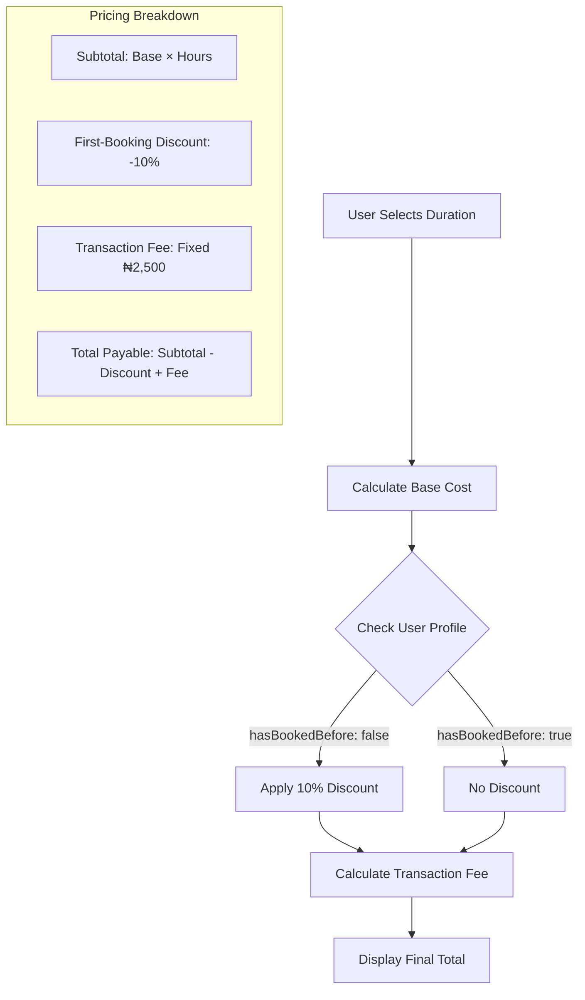
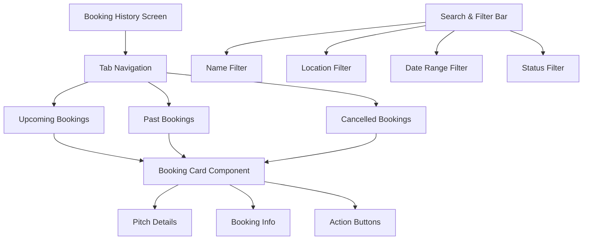
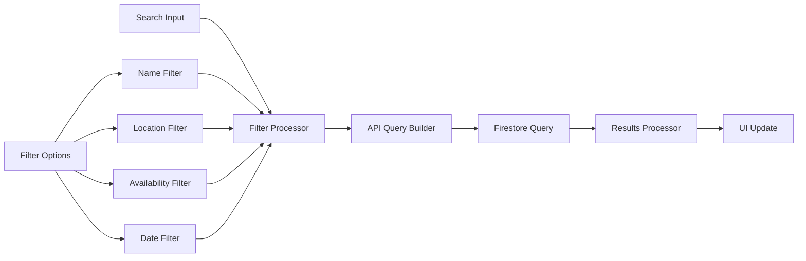
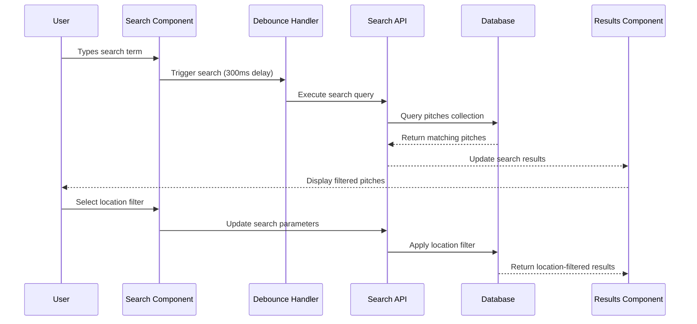
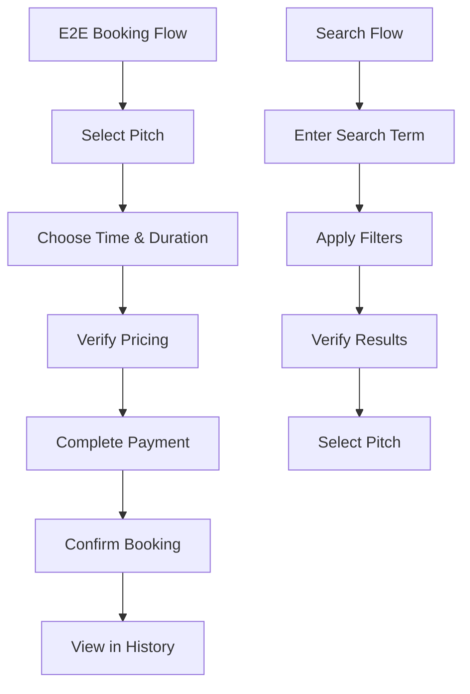

# Enhanced Booking Flow & History Design

## Overview

This design document outlines the enhancements to the PitchLink mobile application's booking system, focusing on creating a predictable, transparent booking process with reliable time slot selection, first-time booking discount implementation, and comprehensive booking history management.

## Technology Stack

- **Frontend**: React Native with Expo SDK 53
- **State Management**: Zustand for global state management
- **Routing**: Expo Router for file-based navigation
- **Data Persistence**: Expo SecureStore for secure local storage
- **Database**: Firestore for backend data management
- **Styling**: React Native StyleSheet with dynamic theming

## Architecture

### Component Hierarchy



### State Management Architecture



## Time Slot Selection Enhancement

### Sequential Time Slot Logic



### Time Slot Display Component

| Component | Properties | Behavior |
|-----------|------------|----------|
| TimeSlotGrid | `availableSlots: Array` | Displays chronological time slots (09:00-21:00) |
| TimeSlotButton | `time: String, available: Boolean, selected: Boolean` | Visual feedback for slot status |
| DurationSelector | `selectedTime: String, availableHours: Array` | Shows 1, 2, 3-hour options when time selected |
| PricingDisplay | `basePricePerHour: Number, duration: Number` | Real-time pricing calculation |

### Time Slot Selection Rules

1. **Fixed Chronological Order**: Time slots displayed sequentially (09:00, 10:00, 11:00, etc.)
2. **Contiguous Selection**: When time selected, highlight next available contiguous slots
3. **Duration Validation**: Ensure selected duration doesn't conflict with existing bookings
4. **Visual Feedback**: Clear indication of selected time, duration, and pricing

## First-Time Booking Discount System

### Discount Calculation Logic



### Pricing Calculation Model

| Field | Calculation | Example (1hr, ₦12,500/hr, First Booking) |
|-------|-------------|-------------------------------------------|
| Subtotal | `basePricePerHour × duration` | ₦12,500 × 1 = ₦12,500 |
| First-Booking Discount | `subtotal × 0.1` (if eligible) | ₦12,500 × 0.1 = ₦1,250 |
| Transaction Fee | Fixed amount | ₦2,500 |
| Total Payable | `subtotal - discount + transactionFee` | ₦12,500 - ₦1,250 + ₦2,500 = ₦13,750 |

### User Profile Integration

```typescript
interface UserProfile {
  userId: string;
  hasBookedBefore: boolean;
  totalBookings: number;
  firstBookingDate?: string;
  discountEligible: boolean;
}

interface DiscountCalculation {
  subtotal: number;
  discountAmount: number;
  discountPercentage: number;
  transactionFee: number;
  total: number;
  isFirstBooking: boolean;
}
```

## Enhanced Booking Store

### Store Structure Enhancement

```typescript
interface EnhancedBookingStore {
  // Existing state
  bookings: Booking[];
  currentBooking: Booking | null;
  isLoading: boolean;
  error: string | null;
  
  // New state for enhanced flow
  selectedDate: Date | null;
  selectedTime: string | null;
  selectedDuration: number;
  availableTimeSlots: TimeSlot[];
  pricingBreakdown: PricingBreakdown | null;
  
  // Enhanced actions
  setTimeSlot: (date: Date, time: string) => void;
  setDuration: (duration: number) => void;
  calculateDynamicPricing: (basePricePerHour: number, duration: number, isFirstBooking: boolean) => PricingBreakdown;
  validateSlotAvailability: (date: Date, time: string, duration: number) => boolean;
  getContiguousSlots: (selectedTime: string) => string[];
  checkFirstTimeBookingEligibility: (userId: string) => Promise<boolean>;
  updateUserBookingStatus: (userId: string) => Promise<void>;
}
```

### Dynamic Pricing Function

```typescript
const calculateEnhancedPricing = (
  basePricePerHour: number, 
  duration: number, 
  isFirstBooking: boolean
): PricingBreakdown => {
  const subtotal = basePricePerHour * duration;
  const discountAmount = isFirstBooking ? subtotal * 0.1 : 0;
  const transactionFee = 2500; // Fixed fee
  const total = subtotal - discountAmount + transactionFee;
  
  return {
    subtotal,
    discountAmount,
    discountPercentage: isFirstBooking ? 10 : 0,
    transactionFee,
    total,
    isFirstBooking,
    breakdown: {
      basePricePerHour,
      duration,
      hourlyTotal: subtotal,
      savings: discountAmount
    }
  };
};
```

## Booking History System

### Booking History Architecture



### Booking Card Component Structure

| Element | Description | Data Source |
|---------|-------------|-------------|
| Pitch Image | Thumbnail image | `booking.pitchImage` |
| Pitch Name | Venue name | `booking.pitchName` |
| Location | Full address | `booking.location` |
| Date & Time | Formatted booking datetime | `booking.date`, `booking.time` |
| Duration | Hours booked | `booking.duration` |
| Total Cost | Final amount paid | `booking.totalPrice` |
| Status Badge | Booking status indicator | `booking.status` |
| Action Button | Context-sensitive actions | Based on status and date |

### Booking History Data Model

```typescript
interface BookingHistoryItem {
  id: string;
  pitchName: string;
  pitchImage: string;
  location: string;
  date: string;
  time: string;
  duration: number;
  totalCost: number;
  status: 'confirmed' | 'completed' | 'cancelled';
  bookingRef: string;
  createdAt: string;
  updatedAt: string;
  receipt?: BookingReceipt;
}

interface BookingFilter {
  searchTerm: string;
  location: string;
  dateRange: {
    start: Date | null;
    end: Date | null;
  };
  status: string[];
}
```

## Home Page Search Enhancement

### Search Component Architecture



### Search Filter Implementation

```typescript
interface SearchFilters {
  searchTerm: string;
  location: string;
  selectedDate: Date | null;
  availabilityOnly: boolean;
  priceRange: {
    min: number;
    max: number;
  };
  pitchType: string[];
  amenities: string[];
}

interface SearchResult {
  pitches: Pitch[];
  totalCount: number;
  searchTime: number;
  appliedFilters: SearchFilters;
}
```

### Real-time Search Flow



## Database Schema Enhancements

### User Profile Schema

```typescript
interface UserProfile {
  userId: string;
  email: string;
  displayName: string;
  hasBookedBefore: boolean;
  totalBookings: number;
  firstBookingDate?: Timestamp;
  preferences: {
    preferredLocations: string[];
    preferredPitchTypes: string[];
    notifications: boolean;
  };
  createdAt: Timestamp;
  updatedAt: Timestamp;
}
```

### Booking Schema Enhancement

```typescript
interface Booking {
  id: string;
  userId: string;
  pitchId: string;
  pitchName: string;
  pitchImage: string;
  date: Timestamp;
  time: string;
  duration: number;
  status: 'confirmed' | 'completed' | 'cancelled';
  pricing: {
    basePricePerHour: number;
    subtotal: number;
    discountAmount: number;
    transactionFee: number;
    total: number;
    isFirstBooking: boolean;
  };
  location: string;
  bookingRef: string;
  receipt?: BookingReceipt;
  createdAt: Timestamp;
  updatedAt: Timestamp;
}
```

## Component Updates

### Enhanced Pitch Details Screen

```typescript
// Key enhancements to pitch/[id].jsx
const PitchDetailsEnhancements = {
  timeSlotSelection: {
    chronologicalOrder: true,
    contiguousHighlighting: true,
    durationValidation: true
  },
  durationSelection: {
    options: [1, 2, 3], // hours
    realTimePricing: true,
    discountDisplay: true
  },
  pricingDisplay: {
    dynamicCalculation: true,
    breakdownVisibility: true,
    firstBookingDiscount: true
  }
};
```

### Enhanced Booking Summary Screen

```typescript
// Key enhancements to booking-summary.jsx
const BookingSummaryEnhancements = {
  pricingBreakdown: {
    subtotalDisplay: true,
    discountHighlight: true,
    transactionFeeClarity: true,
    totalCalculation: true
  },
  userFeedback: {
    firstBookingBadge: true,
    savingsHighlight: true,
    nextStepsGuidance: true
  }
};
```

### New Booking History Screen

```typescript
// Enhanced bookings.jsx
const BookingHistoryEnhancements = {
  tabNavigation: {
    upcoming: true,
    past: true,
    cancelled: true
  },
  searchFunctionality: {
    realTimeFilter: true,
    multiCriteriaSearch: true,
    resultsSorting: true
  },
  cardDesign: {
    compactLayout: true,
    statusIndicators: true,
    actionButtons: true
  }
};
```

## Testing Strategy

### Unit Testing

| Component | Test Cases | Coverage |
|-----------|------------|----------|
| Time Slot Selection | Chronological order, contiguous highlighting, availability validation | 95% |
| Pricing Calculator | First-time discount, transaction fee calculation, edge cases | 100% |
| Booking Store | CRUD operations, state consistency, error handling | 90% |
| Search Filter | Query building, real-time updates, result accuracy | 85% |

### Integration Testing



### Performance Testing

- **Search Response Time**: < 500ms for typical queries
- **Booking Creation**: < 2 seconds end-to-end
- **History Loading**: < 1 second for 100+ bookings
- **Real-time Updates**: < 300ms for pricing calculations