# Premium News & Live Streaming Feature Design

## Overview

This design document outlines the transformation of the existing "News & Live Scores" page into a premium, subscription-based service featuring personalized content, live match streaming, and a comprehensive revenue generation system for the player-side mobile application.

### Key Objectives
- Transform existing news page into a freemium model with premium content tiers
- Implement subscription-based live streaming for football matches
- Create personalized content experience based on user's favorite club
- Establish new revenue stream through subscription services
- Provide dynamic pricing with first-time user discounts

## Technology Stack Integration

### Mobile Application Stack
- **Framework**: React Native with Expo SDK 53
- **State Management**: Zustand for subscription and user preference states
- **Payment Processing**: Integration with existing Stripe infrastructure
- **Secure Storage**: Expo SecureStore for subscription status and user preferences
- **Navigation**: Expo Router for seamless page transitions
- **Authentication**: Leveraging existing auth system with enhanced user profile fields

### Subscription Infrastructure
- **Payment Gateway**: Stripe subscriptions API (already integrated in web version)
- **Backend Integration**: Extend existing API endpoints for subscription management
- **Data Persistence**: SecureStore for offline subscription status
- **Price Management**: Dynamic pricing calculation with discount logic

## Architecture

### Component Hierarchy

```mermaid
graph TD
    A[Premium News Screen] --> B[Subscription Header]
    A --> C[Paywall Modal]
    A --> D[Club Selection Modal]
    A --> E[Free Content Section]
    A --> F[Premium Content Section]
    A --> G[Live Streaming Section]
    A --> H[Search Component]
    
    B --> B1[Go Premium Button]
    B --> B2[Subscription Status]
    
    C --> C1[Pricing Display]
    C --> C2[First-Time Discount Logic]
    C --> C3[Payment Integration]
    
    D --> D1[Club Search Bar]
    D --> D2[Club List]
    D --> D3[Club Selection Persistence]
    
    F --> F1[Personalized Club News]
    F --> F2[Premium Article Access]
    F --> F3[Advanced Statistics]
    
    G --> G1[Live Match List]
    G --> G2[Watch Live Button]
    G --> G3[Live Stream Player]
    
    style A fill:#f9f,stroke:#333,stroke-width:2px
    style C fill:#ffd,stroke:#333,stroke-width:2px
    style G fill:#dfd,stroke:#333,stroke-width:2px
```

### State Management Architecture

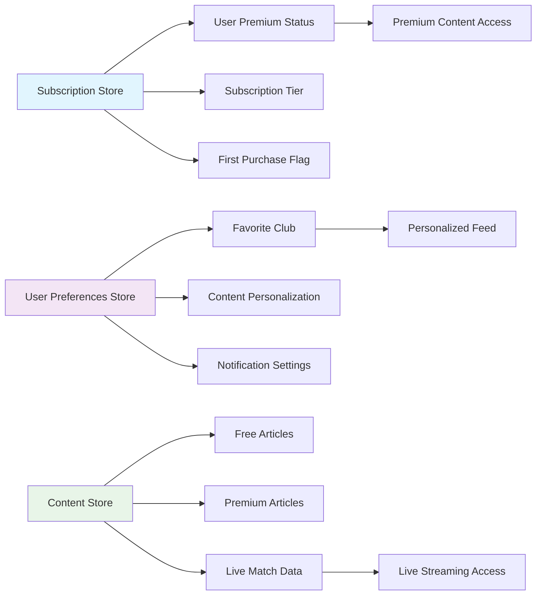

## Data Models

### Enhanced User Profile Model
```javascript
interface UserProfile {
  id: string;
  email: string;
  name: string;
  // Existing fields...
  
  // Premium subscription fields
  isPremium: boolean;
  subscriptionTier: 'free' | 'premium';
  subscriptionStatus: 'active' | 'inactive' | 'cancelled' | 'past_due';
  currentPeriodEnd: Date;
  firstPurchaseDate: Date | null;
  stripeCustomerId: string | null;
  stripeSubscriptionId: string | null;
  
  // Content personalization
  favoriteClub: {
    id: string;
    name: string;
    league: string;
    logoUrl: string;
  } | null;
  
  // Usage tracking
  contentInteractions: {
    articlesRead: number;
    streamingMinutes: number;
    lastActiveDate: Date;
  };
}
```

### Subscription Model
```javascript
interface Subscription {
  id: string;
  userId: string;
  status: 'active' | 'cancelled' | 'past_due' | 'unpaid';
  currentPeriodStart: Date;
  currentPeriodEnd: Date;
  cancelAtPeriodEnd: boolean;
  tier: 'premium';
  pricing: {
    monthly: number; // 450 NGN
    yearly: number;  // 5400 NGN
    firstTimeMonthly: number; // 370 NGN
  };
  stripeSubscriptionId: string;
  createdAt: Date;
  updatedAt: Date;
}
```

### Content Model
```javascript
interface NewsArticle {
  id: string;
  title: string;
  summary: string;
  content: string;
  imageUrl: string;
  category: string;
  publishedAt: Date;
  readTime: number;
  
  // Premium content flags
  isPremium: boolean;
  accessLevel: 'free' | 'premium';
  
  // Club association
  relatedClubs: string[];
  tags: string[];
}

interface LiveMatch {
  id: string;
  homeTeam: Team;
  awayTeam: Team;
  competition: string;
  matchDate: Date;
  status: 'scheduled' | 'live' | 'finished';
  score: {
    home: number | null;
    away: number | null;
  };
  
  // Streaming configuration
  hasLiveStream: boolean;
  streamUrl: string | null;
  requiresPremium: boolean;
}
```

## Premium Features Implementation

### 1. Dynamic Pricing System

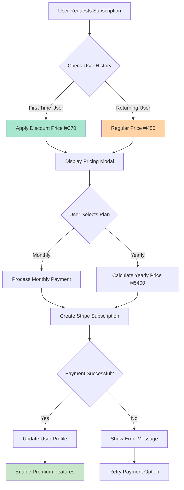

### 2. Club Selection & Personalization

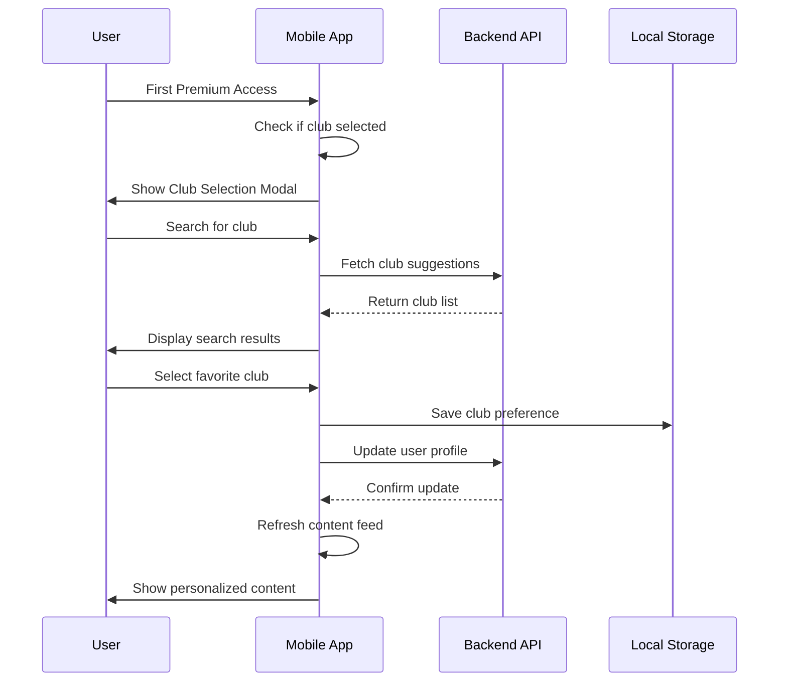

### 3. Content Access Control

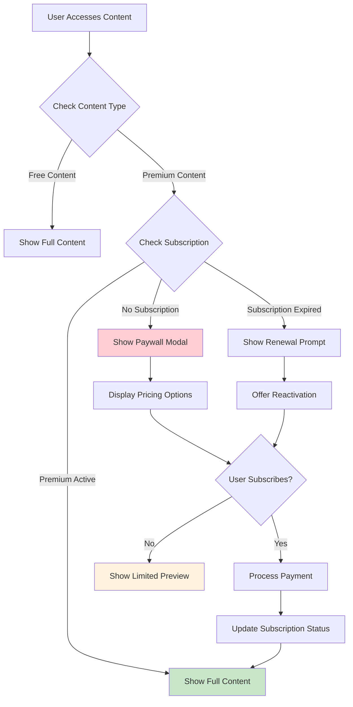

## User Interface Design

### Premium Landing Page Layout

```mermaid
graph TD
    A[Header Section] --> A1[Premium Badge/Status]
    A --> A2[Go Premium Button - if not subscribed]
    A --> A3[Search Bar]
    
    B[Free Content Teaser] --> B1[General Football Headlines]
    B --> B2[Basic Live Scores]
    B --> B3[Limited Article Previews]
    
    C[Premium Content Preview] --> C1[Club-Specific News - Locked]
    C --> C2[Detailed Match Analysis - Locked]
    C --> C3[Live Streaming Options - Locked]
    
    D[Live Streaming Section] --> D1[Upcoming Matches]
    D --> D2[Watch Live Buttons]
    D --> D3[Premium Stream Quality Info]
    
    E[Subscription CTA] --> E1[Pricing Display]
    E --> E2[Feature Benefits List]
    E --> E3[First-Time Discount Highlight]
    
    style A fill:#e3f2fd
    style C fill:#fff3e0
    style E fill:#f3e5f5
```

### Paywall Modal Components

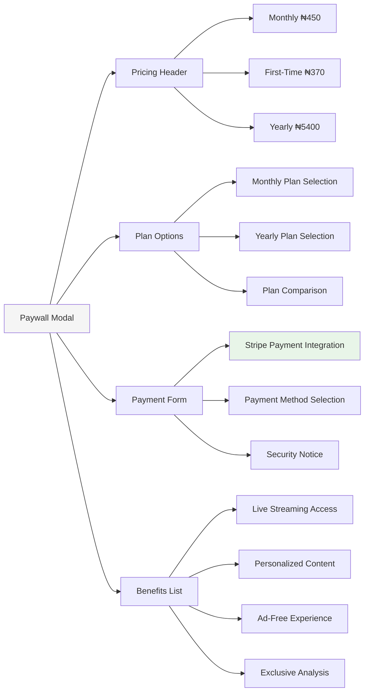

## Live Streaming Integration

### Stream Access Control Flow

```mermaid
flowchart TD
    A[User Taps "Watch Live"] --> B{Check Subscription Status}
    B -->|Premium Active| C[Verify Stream Availability]
    B -->|No Subscription| D[Show Subscription Modal]
    
    C -->|Stream Available| E[Load Video Player]
    C -->|Stream Unavailable| F[Show "Coming Soon" Message]
    
    D --> G{User Subscribes?}
    G -->|Yes| H[Process Payment]
    G -->|No| I[Return to Content]
    
    H --> J{Payment Success?}
    J -->|Yes| K[Update Subscription Status]
    J -->|No| L[Show Payment Error]
    
    K --> C
    L --> D
    
    E --> M[Full-Screen Video Player]
    M --> N[Live Commentary]
    M --> O[Match Statistics]
    
    style E fill:#c8e6c9
    style D fill:#ffcdd2
    style M fill:#e1f5fe
```

### Live Stream Player Features

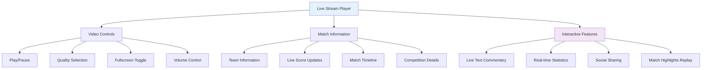

## Search & Discovery Features

### Enhanced Search Implementation

```mermaid
graph TD
    A[Search Input] --> B[Search Processing]
    B --> C[Content Filtering]
    
    C --> D[Free Content Results]
    C --> E[Premium Content Results]
    C --> F[Live Match Results]
    
    E --> G{User Subscription Check}
    G -->|Premium| H[Show Full Results]
    G -->|Free| I[Show Premium Teasers]
    
    F --> J{Match Status Check}
    J -->|Live| K[Show "Watch Live" Option]
    J -->|Upcoming| L[Show "Notify Me" Option]
    J -->|Finished| M[Show Highlights Option]
    
    I --> N[Upgrade Prompt]
    K --> O{Subscription Check}
    O -->|Premium| P[Direct Stream Access]
    O -->|Free| Q[Subscription Prompt]
    
    style A fill:#e8f5e8
    style H fill:#c8e6c9
    style N fill:#ffcdd2
    style P fill:#e1f5fe
```

## Payment Integration Architecture

### Stripe Integration Flow

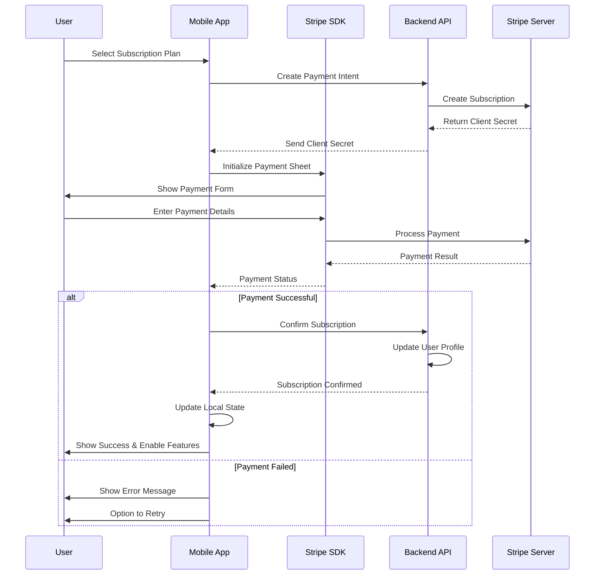

### Subscription State Management

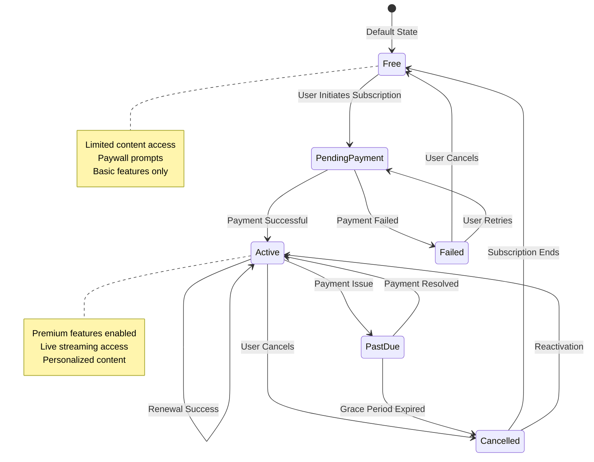

## Error Handling & Edge Cases

### Subscription Management Error Handling

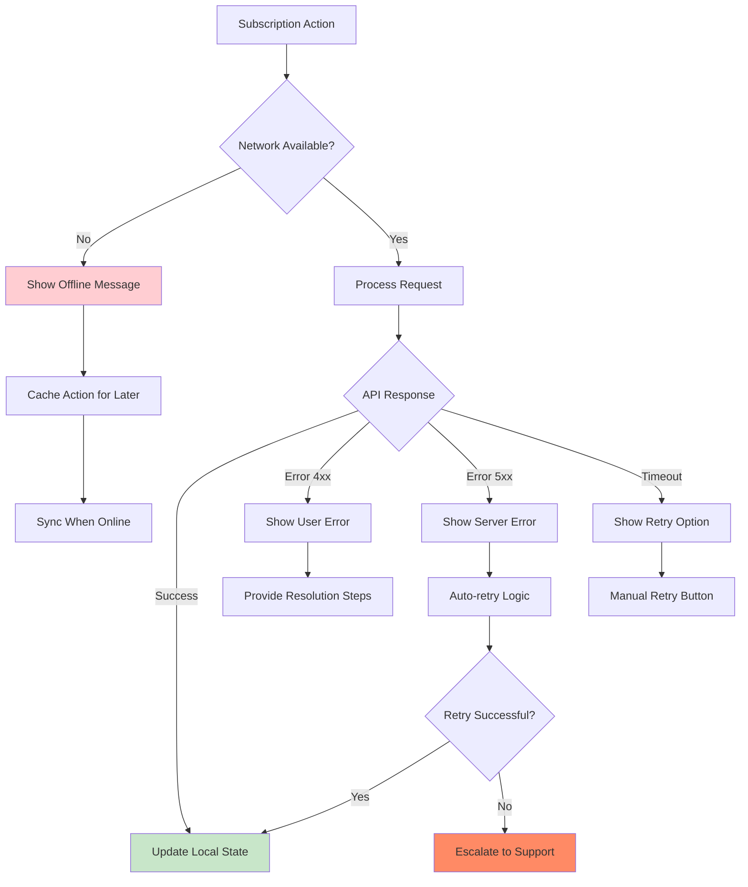

### Content Loading States

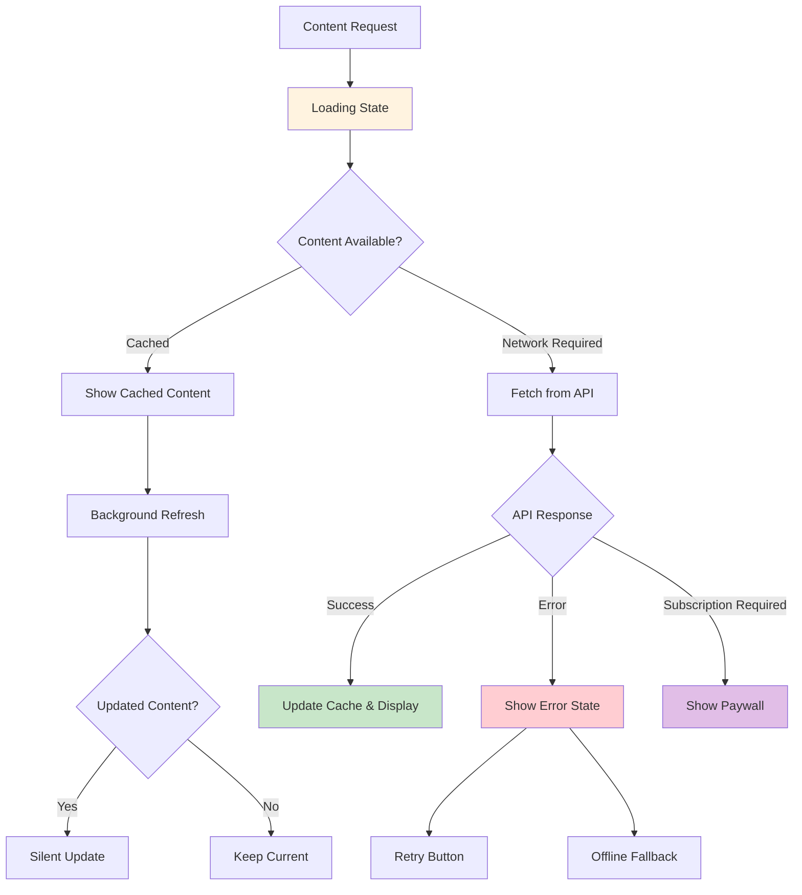

## Testing Strategy

### Unit Testing Components

| Component | Test Coverage | Key Test Cases |
|-----------|---------------|----------------|
| PremiumNewsScreen | 90%+ | Subscription status display, content filtering, paywall triggers |
| PaywallModal | 95%+ | Pricing calculations, discount logic, payment flow initiation |
| ClubSelectionModal | 85%+ | Search functionality, club selection persistence, API integration |
| LiveStreamPlayer | 80%+ | Stream loading, quality selection, premium access control |
| SubscriptionStore | 95%+ | State management, persistence, sync operations |

### Integration Testing Scenarios

```mermaid
graph TD
    A[Integration Tests] --> B[Payment Flow Tests]
    A --> C[Content Access Tests]
    A --> D[Club Selection Tests]
    A --> E[Live Streaming Tests]
    
    B --> B1[First-time User Discount]
    B --> B2[Subscription Renewal]
    B --> B3[Payment Failure Handling]
    B --> B4[Subscription Cancellation]
    
    C --> C1[Free vs Premium Content]
    C --> C2[Paywall Triggers]
    C --> C3[Content Personalization]
    C --> C4[Search Functionality]
    
    D --> D1[Club Search & Selection]
    D --> D2[Preference Persistence]
    D --> D3[Content Feed Updates]
    
    E --> E1[Stream Access Control]
    E --> E2[Video Player Integration]
    E --> E3[Quality Adaptation]
    E --> E4[Commentary Sync]
    
    style A fill:#e3f2fd
    style B fill:#fff3e0
    style C fill:#f3e5f5
    style D fill:#e8f5e8
    style E fill:#fce4ec
```

### Performance Testing Requirements

| Metric | Target | Measurement Method |
|--------|--------|--------------------|
| App Launch Time | < 2 seconds | Automated performance tests |
| Content Load Time | < 1.5 seconds | API response monitoring |
| Video Stream Start | < 3 seconds | Video player analytics |
| Payment Processing | < 5 seconds | Stripe webhook monitoring |
| Search Response | < 500ms | Search query performance |
| Club Selection | < 1 second | Modal interaction timing |

## Security Considerations

### Data Protection Measures

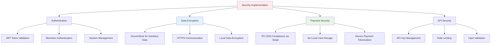

### Privacy & Compliance

| Aspect | Implementation | Compliance Standard |
|--------|----------------|-------------------|
| User Data Collection | Explicit consent for personalization | GDPR Article 6 |
| Payment Information | Stripe-hosted, no local storage | PCI DSS Level 1 |
| Viewing Analytics | Anonymized usage tracking | Privacy by Design |
| Data Retention | Configurable retention periods | GDPR Article 17 |
| User Rights | Data export and deletion options | GDPR Chapter 3 |

## Deployment & Rollout Strategy

### Feature Rollout Phases

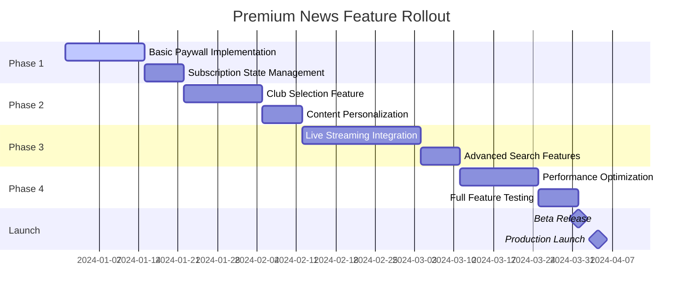

### Monitoring & Analytics

```mermaid
graph TD
    A[Analytics Dashboard] --> B[Subscription Metrics]
    A --> C[Content Engagement]
    A --> D[Technical Performance]
    A --> E[User Experience]
    
    B --> B1[Conversion Rates]
    B --> B2[Churn Analysis]
    B --> B3[Revenue Tracking]
    B --> B4[Discount Effectiveness]
    
    C --> C1[Content Views]
    C --> C2[Time Spent]
    C --> C3[Search Usage]
    C --> C4[Club Preferences]
    
    D --> D1[App Performance]
    D --> D2[API Response Times]
    D --> D3[Stream Quality]
    D --> D4[Error Rates]
    
    E --> E1[User Satisfaction]
    E --> E2[Feature Adoption]
    E --> E3[Support Tickets]
    E --> E4[App Store Ratings]
    
    style A fill:#e3f2fd
    style B fill:#c8e6c9
    style C fill:#fff3e0
    style D fill:#ffcdd2
    style E fill:#f3e5f5
```