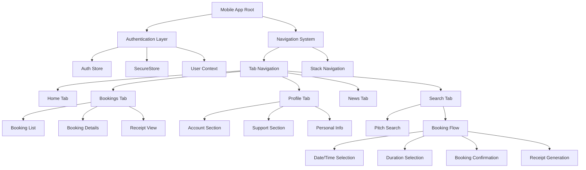
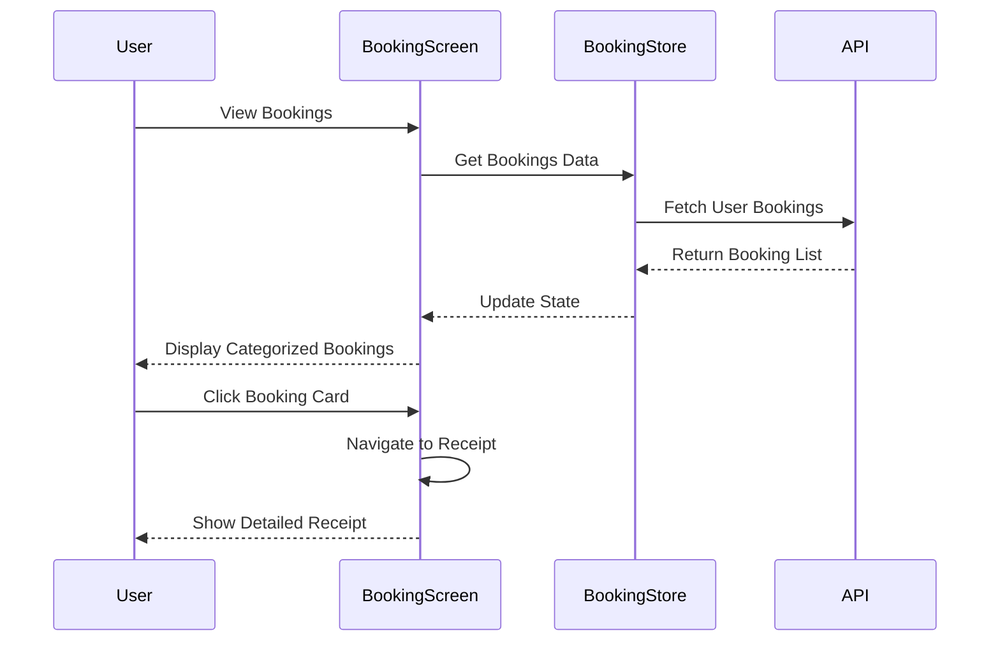
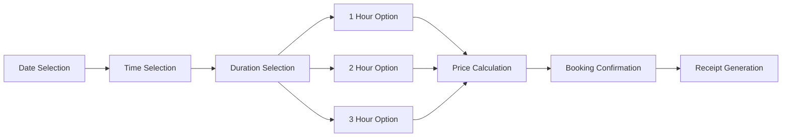
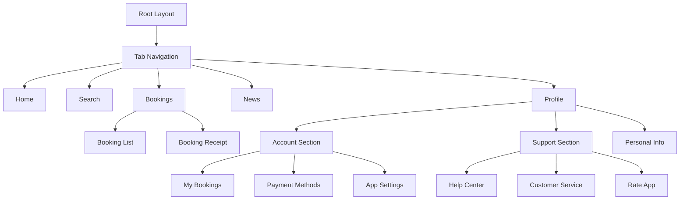
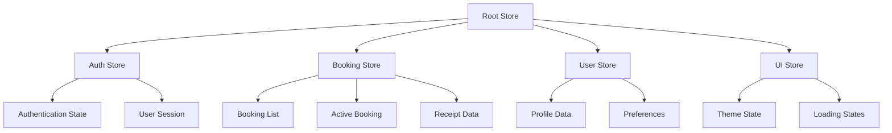

# Complete PitchLink Mobile App Design

## Overview

This design document outlines the implementation of a complete and functional PitchLink mobile application that provides comprehensive booking functionality, user profile management, and enhanced user experience features. The app enables users to book football pitches with flexible duration options (1, 2, or 3 hours), manage their bookings with detailed receipts, and access fully functional account and support sections.

## Technology Stack & Dependencies

The application leverages the following core technologies:

| Component | Technology | Version |
|-----------|------------|---------|
| Framework | React Native | 0.79 |
| Development Platform | Expo | SDK 53 |
| Navigation | Expo Router | 5.1.0 |
| State Management | Zustand | Latest |
| UI Components | React Native + Custom | - |
| Authentication | JWT + SecureStore | - |
| Image Handling | Expo Image | Latest |
| Fonts | Inter Font Family | Latest |

## Architecture

## Component Architecture

### Core Screen Components

#### 1. Enhanced Bookings Screen
- **Booking List Management**: Display categorized bookings (Upcoming, Past, Cancelled)
- **Interactive Booking Cards**: Clickable cards that navigate to detailed receipt view
- **Status Indicators**: Visual status representation with appropriate colors and icons
- **Action Buttons**: Context-sensitive actions (Cancel, Contact, View Receipt)

#### 2. Booking Receipt Component
- **Detailed Information Display**: Complete booking information with status
- **Approved Status**: Clear "Approved" status indication as proof
- **Print/Share Functionality**: Export receipt as PDF or share via platforms
- **QR Code Integration**: Unique booking reference with QR code

#### 3. Enhanced Profile Screen
- **Account Section**: Fully functional account management
- **Support Section**: Complete customer support integration
- **Personal Information**: Editable user profile data
- **Navigation Integration**: Seamless routing to all profile subsections

#### 4. Booking Flow Enhancement
- **Date & Time Picker**: Intuitive calendar and time selection
- **Duration Selection**: 1, 2, or 3-hour booking options
- **Price Calculation**: Dynamic pricing based on duration
- **Automatic Receipt**: Post-booking receipt generation

## Detailed Feature Implementation

### Booking Management System

#### Booking List Display

#### Booking Data Model
| Field | Type | Description |
|-------|------|-------------|
| id | String | Unique booking identifier |
| pitchName | String | Name of booked pitch |
| pitchImage | String | Pitch image URL |
| date | Date | Booking date |
| time | String | Booking time slot |
| duration | Number | Booking duration (1-3 hours) |
| location | String | Pitch location address |
| price | Number | Total booking price |
| status | Enum | confirmed/completed/cancelled |
| bookingRef | String | Booking reference code |
| receipt | Object | Detailed receipt information |

### Enhanced User Profile

#### Account Section Features
- **Personal Information Management**: Editable profile fields
- **Booking History**: Quick access to all bookings
- **Payment Methods**: Saved payment options management
- **App Settings**: Notification and preference controls
- **Security Settings**: Password and privacy controls

#### Support Section Features
- **Help Center**: FAQ and troubleshooting guides
- **Customer Service**: Direct contact options (chat, email, phone)
- **Feedback System**: App rating and feedback submission
- **Legal Information**: Terms of service and privacy policy
- **Version Information**: App version and update status

### Booking Flow Enhancement

#### Duration Selection Interface

#### Duration Pricing Logic
| Duration | Base Multiplier | Dynamic Pricing |
|----------|----------------|-----------------|
| 1 Hour | 1.0x | Peak/off-peak rates |
| 2 Hours | 1.8x | Bundle discount applied |
| 3 Hours | 2.5x | Maximum discount |

### Receipt System

#### Receipt Components
- **Header Information**: Booking confirmation title and reference
- **Pitch Details**: Name, location, and image
- **Booking Information**: Date, time, duration, and status
- **Pricing Breakdown**: Base price, fees, and total cost
- **Status Indicator**: Large "APPROVED" status badge
- **QR Code**: Scannable booking verification
- **Terms & Conditions**: Relevant booking policies

#### Receipt Actions
- **Save to Gallery**: Export as image
- **Share Receipt**: Via messaging, email, or social media
- **Print Receipt**: Direct printing capability
- **Add to Calendar**: Booking reminder integration

## User Interface Design

### Design System

#### Color Palette
| Usage | Light Mode | Dark Mode | Hex Code |
|-------|------------|-----------|----------|
| Primary | Bright Green | Bright Green | #00FF88 |
| Background | Off White | Deep Black | #F8F9FA / #0A0A0A |
| Surface | White | Dark Gray | #FFFFFF / #1E1E1E |
| Text Primary | Black | White | #000000 / #FFFFFF |
| Text Secondary | Gray | Light Gray | #6B7280 / #9CA3AF |
| Success | Green | Green | #00FF88 |
| Warning | Orange | Orange | #FF6B00 |
| Error | Red | Red | #EF4444 |

#### Typography Scale
| Style | Font Weight | Size | Usage |
|-------|-------------|------|-------|
| Heading 1 | Bold (700) | 28px | Screen titles |
| Heading 2 | SemiBold (600) | 20px | Section headers |
| Body Large | Medium (500) | 16px | Primary content |
| Body | Regular (400) | 14px | Secondary content |
| Caption | Regular (400) | 12px | Supporting text |

### Responsive Design Considerations

#### Screen Adaptations
- **iPhone SE**: Compact layout with scrollable content
- **Standard iPhones**: Optimized spacing and component sizing
- **iPhone Pro Max**: Enhanced layout utilization
- **Android Devices**: Material Design compliance
- **Tablet Support**: Adaptive grid layouts for larger screens

#### Accessibility Features
- **VoiceOver Support**: Screen reader compatibility
- **Dynamic Type**: Font size scaling support
- **High Contrast**: Enhanced visibility options
- **Touch Targets**: Minimum 44pt touch areas
- **Color Independence**: Non-color-dependent information

## Navigation Architecture

### Tab Structure

### Navigation Flow
- **Deep Linking**: Support for booking receipt direct access
- **State Persistence**: Maintain navigation state across app sessions
- **Back Navigation**: Consistent back button behavior
- **Tab Switching**: Smooth transitions between main sections

## State Management

### Store Architecture

### Data Flow Patterns
- **Centralized State**: Zustand stores for global state
- **Local State**: React hooks for component-specific state
- **Persistent Storage**: SecureStore for sensitive data
- **Cache Management**: React Query for API data caching

## API Integration

### Booking Endpoints
| Endpoint | Method | Purpose |
|----------|--------|---------|
| `/bookings` | GET | Fetch user bookings |
| `/bookings/{id}` | GET | Get booking details |
| `/bookings` | POST | Create new booking |
| `/bookings/{id}` | PUT | Update booking |
| `/bookings/{id}/cancel` | POST | Cancel booking |
| `/bookings/{id}/receipt` | GET | Generate receipt |

### Error Handling
- **Network Errors**: Retry mechanisms with exponential backoff
- **API Errors**: User-friendly error messages
- **Validation Errors**: Inline form validation
- **Offline Support**: Local data persistence and sync

## Testing Strategy

### Unit Testing
- **Component Testing**: React Native Testing Library
- **Hook Testing**: Custom hook unit tests
- **Store Testing**: Zustand store testing
- **Utility Testing**: Helper function tests

### Integration Testing
- **Navigation Testing**: Route and parameter testing
- **API Integration**: Mock API response testing
- **Authentication Flow**: End-to-end auth testing
- **Booking Flow**: Complete booking process testing

### User Acceptance Testing
- **Booking Creation**: Complete 1, 2, 3-hour booking flows
- **Receipt Generation**: Verify receipt content and actions
- **Profile Management**: Account and support section functionality
- **Navigation Testing**: All screen transitions and deep links

## Performance Optimization

### Bundle Optimization
- **Code Splitting**: Feature-based code splitting
- **Image Optimization**: WebP format with fallbacks
- **Font Loading**: Optimized font loading strategy
- **Bundle Analysis**: Regular bundle size monitoring

### Runtime Performance
- **List Virtualization**: Efficient large list rendering
- **Image Caching**: Persistent image cache implementation
- **Memory Management**: Proper component unmounting
- **Animation Performance**: 60fps animation targets

## Security Considerations

### Data Protection
- **Token Storage**: Secure JWT storage using SecureStore
- **Data Encryption**: Sensitive data encryption at rest
- **Network Security**: HTTPS enforcement and certificate pinning
- **Input Validation**: Client and server-side validation

### Authentication Security
- **Session Management**: Secure session handling
- **Biometric Authentication**: Optional biometric login
- **Device Binding**: Device-specific security tokens
- **Logout Security**: Complete session cleanup on logout

## Deployment Configuration

### Build Settings
- **Development**: Expo development build configuration
- **Staging**: Pre-production testing environment
- **Production**: Optimized production builds
- **OTA Updates**: Over-the-air update capability

### Platform-Specific Configurations
- **iOS**: App Store deployment settings
- **Android**: Google Play Store configuration
- **Web**: Progressive Web App support
- **Testing**: TestFlight and internal testing

## Error Handling & Logging

### Error Boundaries
- **Component Error Boundaries**: Graceful error recovery
- **Navigation Error Handling**: Route error management
- **API Error Boundaries**: Network error containment
- **Global Error Handler**: Unhandled error capture

### Logging Strategy
- **Development Logging**: Comprehensive debug logging
- **Production Logging**: Error and analytics logging
- **Crash Reporting**: Automated crash detection
- **User Feedback**: In-app feedback collection

## Monitoring & Analytics

### Performance Monitoring
- **App Performance**: Launch time and navigation metrics
- **API Performance**: Request timing and success rates
- **User Experience**: Screen engagement metrics
- **Error Tracking**: Error frequency and patterns

### User Analytics
- **Booking Patterns**: Duration preferences and timing
- **Feature Usage**: Most used app sections
- **User Journey**: Navigation flow analysis
- **Conversion Metrics**: Booking completion rates